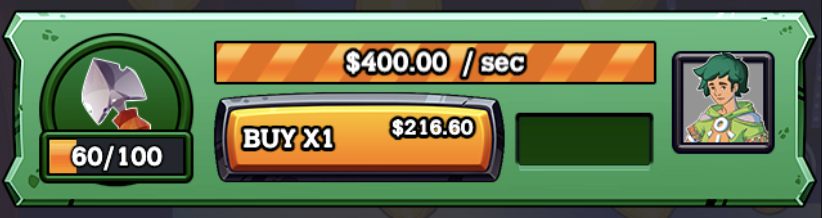
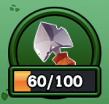
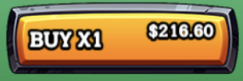
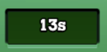
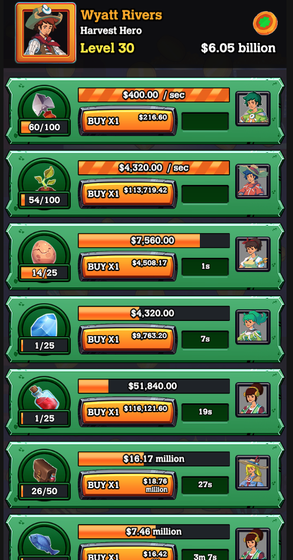
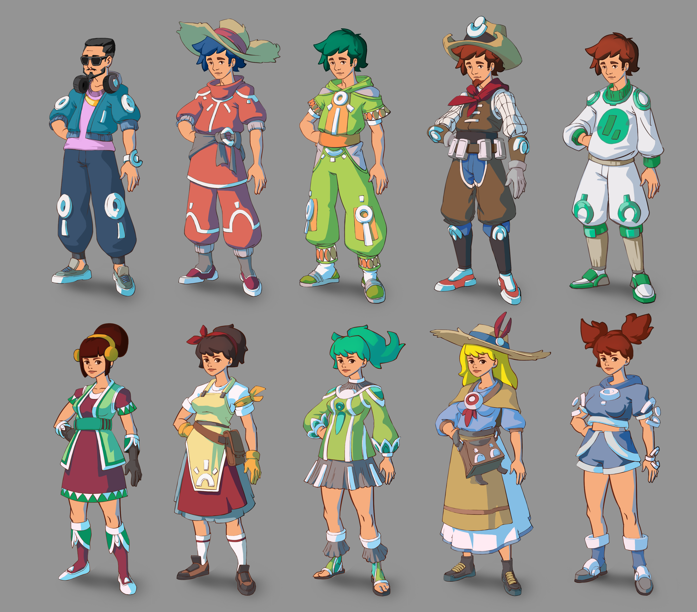
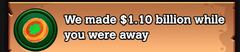

# Ecoland - Future Farm Lands


**Future Farm** is an HTML5 game based on [Adventure Capitalist](https://en.wikipedia.org/wiki/AdVenture_Capitalist)., created with [Phaser3 - Webpack template](https://github.com/phaserjs/template-webpack).
The game was designed mobile first and you can play it now on:

## Development

### Installation

Just run: `$ npm install`

### Run Game

`$ npm run start` the game will be automatically launched on `localhost:8080`. Start script uses livereload.

### Build

To build the game run `$ npm run build` it generates a `dist` folder with: `bundle.min.js`, `index.html` and all the assets on `assets` folder.

If you store the assets in a different static server provider beware to set the awsPrefix=`url` on `src/scenes/ui/boot.js` and `src/scenes/ui/preboot.js` files.

### Deploy

Dist folder can be compressed and upload to any site that support HTML5 games like itch.io or gamejolt.

### Deploy on AWS S3

All assets are stored on S3, to sync your files run `$ aws s3 cp dist/ s3://bucket-url/ --grants read=uri=http://acs.amazonaws.com/groups/global/`
An online version is available on:

### Database

Games played by users could be listed on:

## Project structure

The game uses 4 scenes:

* `src/scenes/ui/boot.js` to load all the assets required for the game
* `src/scenes/ui/preboot.js` only loads the logo and background images in order to provide a better loading screen
* `src/scenes/game/HUDgame.js` displays notifications and avatar related data.
  
* `src/scenes/game/game.js` is the main scene, contains a dictionary of `Business`, sound bg and fxs, particle emitters.

### Time management for idle component

Time update is not handled by phaser as the update process does not work properly when the tab is not visible, to keep the expected idle behaviour for the game a setTimeout approach was made. This is only used for logic calculations.

* `src/managers/timeManager.js` is a singleton that handles a continous loop that notifies every subscriber when a tick has completed sending the delta time to do the proper calculation.

```javascript
  loop() {
    if (!this.running) return
    const now = +Date.now()
    const delta = now - this.lastTime
    this.subscribers.forEach( subscriber => {
      subscriber.updateIdle(delta)
    })
    this.lastTime = now
    setTimeout( _ => this.loop(), RefreshRatio)
  }
```

### Business



`src/scenes/game/business/Business.js`
Is a Container that groups all the behaviour and logic related to the business, is composed by:



`src/scenes/game/businesss/Icon.js`: contains the icon image for the business, handles the action of produce money, and displays the total invesments on this business, also a progress bar indicating how far is to duplicate the production speed.


`src/scenes/game/business/Progress.js` displays the progress of the production and how much money will be generated after completion.



`src/scenes/game/business/Invest.js` handles the action of invest, it also displays the ammount of money required to purchase.



`src/scenes/game/business/Time.js` displays the remaining time to get the money.


`src/scenes/game/business/Manager.js` is a button that allows to purchase a manager to handle automatic production, a farmer sprite is displayed when is active.

### Data

* `src/config/constants.js`: contains all non transient data, this file contains definitions about, resolution, scenes to load, debug mode and business sprites, coefficients an fixed costs.

* `src/config/gameStats.js`: is a variable board containing all logic state that requires to be stored.

Data on `gameStats` is synced every 5 seconds on localstorage (as a fallback) and to a remote server. (see)

## Mechanics

All mechanics are basically the same as adventure capitalist:

* Buy and upgrade business
* Make money from a business
  
  
  
* Hire managers


* When game is closed, the next time you open it, it displays the money that all business made.
  


## Roadmap

* Options to enable/disable music
* Change the name of the farmer
* new mechanics related with managers:
  * pick one of two possible manager for every business
  * each manager has different skills: produce faster, reduce costs,
  * each manager has levels, player need to upgrade managers in order to unlock new skills.
* new mechanics related with business:
  * every business triggers unexpected events, could be bad or good ones. miners discover a big diamond, thieves steal jewels from jewelries.
